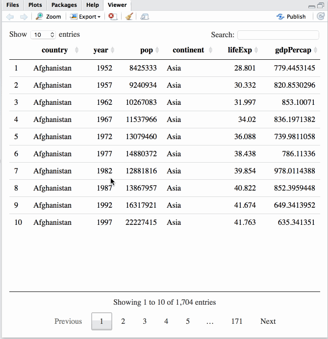

# Putting you data on the map

Plots are nice, but interactive plots are nicer!

Objectives:

* To understand the use of interactive elements
* To be able to place simple markers on a leaflet map
* To be able to create popups with contents that depends on the data


## Interactive elements

The reports you create with Rmarkdown are just webpages underneath. This means
you can embed anything that your browser knows how to display. Including
interactive elements. These are useful if you have a lot of data or want to
let the reader explore the data themselves. A good starting point are the
[R htmlwidgets](http://www.htmlwidgets.org/index.html).


## DataTables

One of the most straightforward interactive element you can use is a table.
Interactive tables are a good way to quickly explore your data, especially for
others who are reading your report. The [`DT` library](https://rstudio.github.io/DT/)
uses HTML and javascript to create a table that let's the reader sort and search
the data.

```{r}
library(DT)
gapminder <- read.csv("data/gapminder-FiveYearData.csv")
datatable(gapminder)
```


It really is this easy to use.

### Challenge

1. Create a new Rmarkdown document and ddd an interactive data table showing
   the gapmidner data to it.
2. Using the search function, can you find out how many entries there are for
   the continent of Asia?


## The mapview library

Quoting from the
[`mapview`](http://environmentalinformatics-marburg.github.io/mapview/introduction.html)
documentation:

---

`mapview` is an R package created to help researchers during their spatial
data analysis workflow. It provides functions to very quickly and conveniently
create interactive visualisations of spatial data.

`mapview` was created o fill the gap of quick (not presentation grade)
interactive plotting to examine and visually investigate spatial data.
So far, one had to either:

* (sp)plot the data in R and then toggle back and forth between
  the static plots; or
* save the data to the disk and then open in QGIS or similar to
  interactively examine the results.

---

This continues the theme of interactively exploring a new dataset or a new idea
on an old dataset. `mapview` is probably not the right tool to produce the
final product that you distribute to users, but it is extremely useful for
your day-to-day work and sharing with collaborators.

We will briefly switch away from the gapminder dataset to
one with information about all the cantons in Switzerland.

```{r}
library(mapview)

data("gadmCHE")

mapview(gadmCHE)
```

```{r}
mapview(gadmCHE, popup=popupTable(gadmCHE, zcol = c("NAME_1")))
```


## Add a new field/columns

```{r}
gadmCHE@data$RandNum <- runif(nrow(gadmCHE@data))
```


## Points are better for popups

```{r}

m <- mapview(gadmCHE)
m

# create a data frame
centres <- data.frame(coordinates(gadmCHE))
names(centres) <- c("x", "y")
# next call turns it back into a spatial points object
coordinates(centres) <- ~ x + y
projection(centres) <- projection(gadmCHE)
m + centres

# join the spatial points with the data
pointsCHE <- sp::SpatialPointsDataFrame(centres, gadmCHE@data)
```

> ## Large data ahead
>
> The following examples use a fairly big data set that you
> need to download. It is only about 500MB but probably the
> conference WiFi will collapse if we all try and download it now.
>
> The data come from [GADM](http://gadm.org/version2) and you want to
> download the [six dissolved layers
> shapefile](http://biogeo.ucdavis.edu/data/gadm2.8/gadm28_levels.shp.zip)


## Loading a shapefile

load shapefile with adm0 level boundaries between countries

```{r}
world <- rgdal::readOGR("/Users/thead/Downloads/gadm28_levels/", layer="gadm28_adm0")
keep <- c("NAME_LOCAL", "POPSQKM") # columns to keep
eu <- world[world$EU==1, (names(world) %in% keep)]
```

## Plot population density in Europe

```{r}
mapview(eu, zcol="POPSQKM", at=seq(0,500, 100), legend=TRUE)
```

```{r}
library(sp)
library(rgdal)
library(raster)

# create a SpatialPointsDataFrame
eu.centers <- data.frame(coordinates(eu))
names(eu.centers) <- c("x", "y")
coordinates(eu.centers) <- ~x+y
projection(eu.centers) <- projection(eu)

mapview(eu.centers)
# put the data back
euPoints <- sp::SpatialPointsDataFrame(eu.centers, eu@data)
mapview(euPoints)
mapview(euPoints, cex='POPSQKM', legend=TRUE)
```

```{r}
# using points for a world wide view
wp <- SpatialPointsDataFrame(coordinates(world), world@data)
projection(wp) <- projection(world)
mapview(wp, cex='POP2000', zcol=c('POPSQKM', "gdpPercap"), legend=TRUE)
```

```{r}
# join gadm dataset with gapminder
gm <- read.csv("gapminder.csv")
gm$NAME = toupper(gm$country)
df <- gm[gm$year==2007,]
world@data = data.frame(world@data, df[match(world@data[,"NAME_ISO"], df[,"NAME"]),])
```

## Leaflet

[Leaflet](http://leafletjs.com/) is a javascript library that is commonly
used to create interactive webmaps. There is an R library that allows you to
use `leaflet` without having to know any javascript.

Use this if you want ultimate control over your map. In exchange it is a
little less easy to use than `mapview`.


## Resources

Hungry for more? Keep reading:

Consult the [spatial R cheatsheet
](http://www.maths.lancs.ac.uk/~rowlings/Teaching/UseR2012/cheatsheet.html) if
you need to refresh your memory.

Take a look at the [geospatial packages](https://ropensci.org/packages/) created
by Ropensci.

http://rstudio.github.io/leaflet/  
http://www.htmlwidgets.org/showcase_datatables.html  
http://www.htmlwidgets.org/showcase_dygraphs.html

http://journocode.com/2016/01/28/your-first-choropleth-map/  
https://rpubs.com/walkerke/leaflet_choropleth

HOTOSM does amazing work producing maps during disasters. A source
of up-to-date shapefiles is http://export.hotosm.org/en/exports/create/


## Write to ESRI shapefiles

```{r}
rgdal::writeOGR(eu, '/tmp/', layer='eu', driver='ESRI Shapefile')
```
